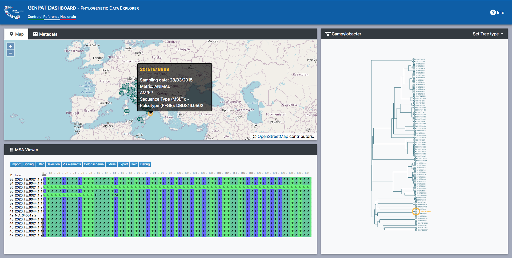

# genpat-dashboard
GenPat-Dashboard web application (still under development)

## Installation
This is a pure javascript client application, easy to install and deploy in your own environment. Follow these steps:

  * Clone the repo in your local working directory 
    ```
    git clone https://github.com/genpat-it/genpat-dashboard.git
    ```
    alternativelly, you can simply download the repo as a zip archive and unzip it

  * Cd to your working directory and install the packages from the package.json 
    ```
    npm install
    ``` 
  * Run the build npm script to consolidate test data
    ```
    npm run build
    ```
## Usage
  * Start GenPAT-Dashboard on the development server at localhost:1234
    ```
    npm run start
    ```
  * Pass parameters in the query string, for example:<br/>
    http://localhost:1234/?geo=data/points_listeria.geojson&fasta=data/allineamento_test.fasta&tree=data/tree_listeria.nwk&treetitle=Listeria
    
## Accepted parameters
  * **geo**: path to geojson point collection
  * **tree**: path to phylogenetic tree in nwk format
  * **treetitle**: a name for the tree
  * **fasta**: path to fasta file (it will be represented using the integrated MSA viewer)
  * **meta**: path to metadata table in json format


